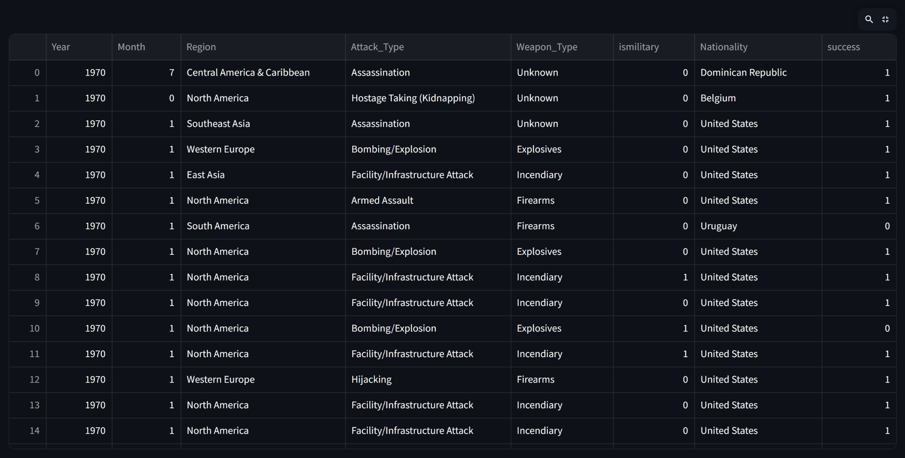
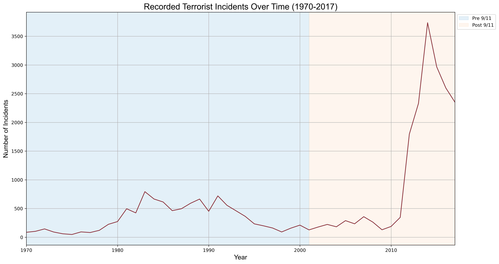
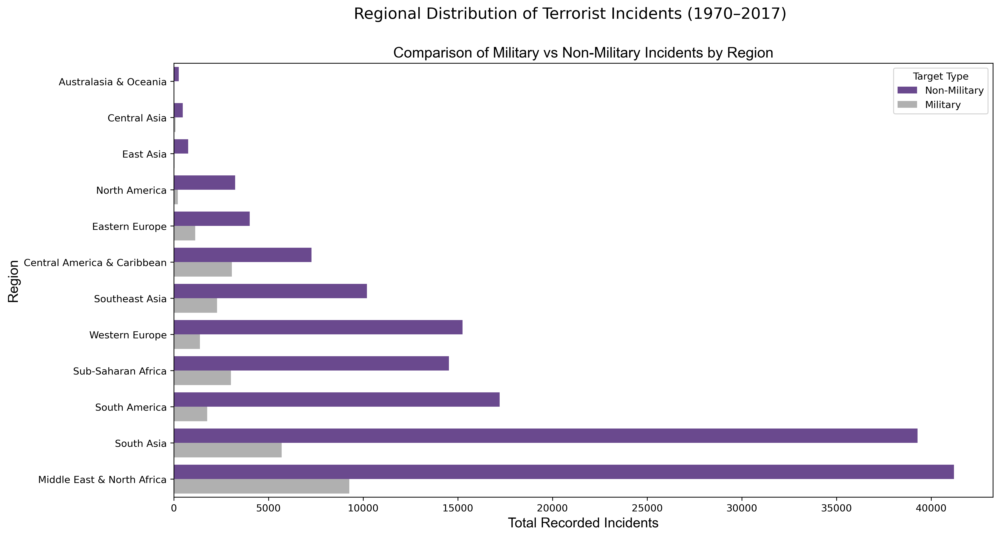
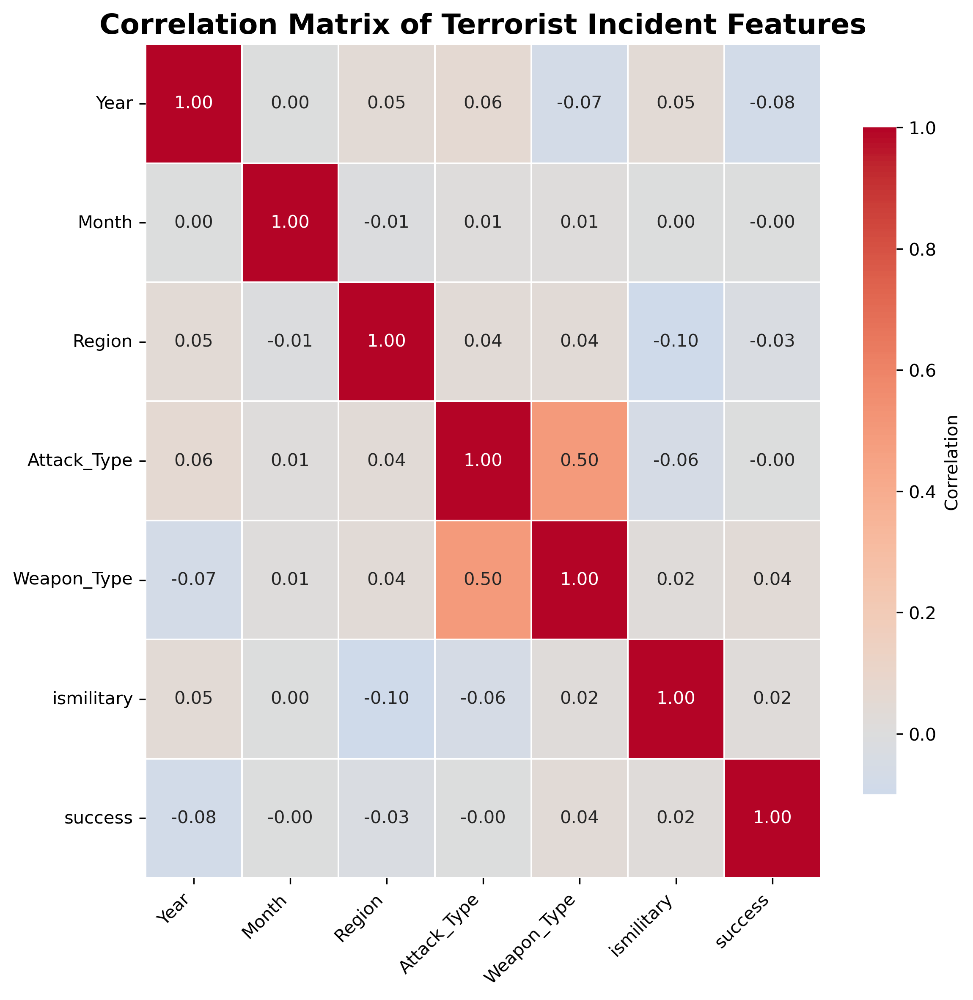
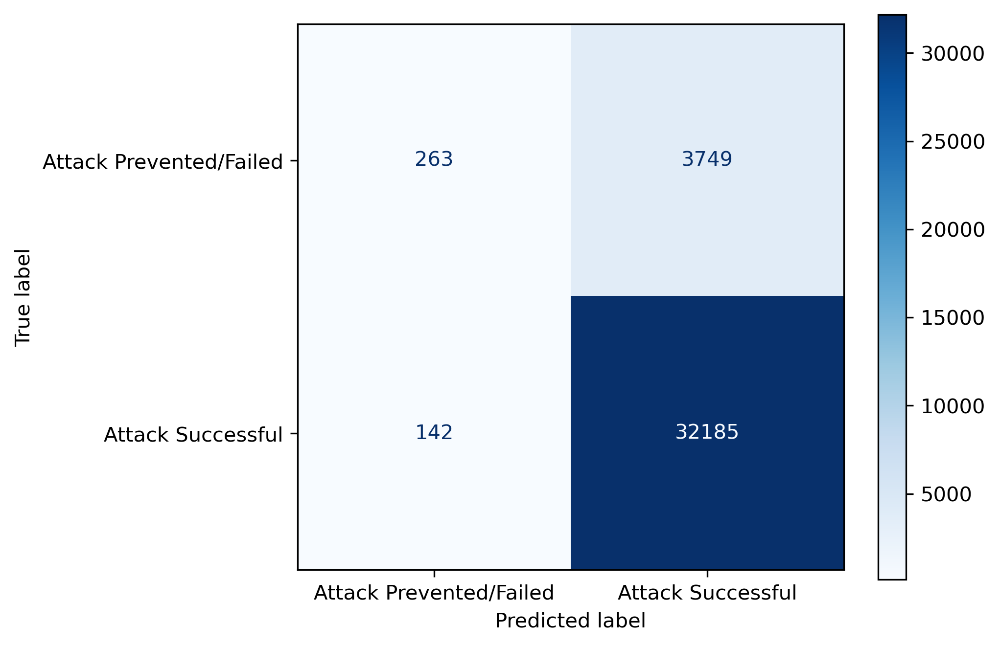
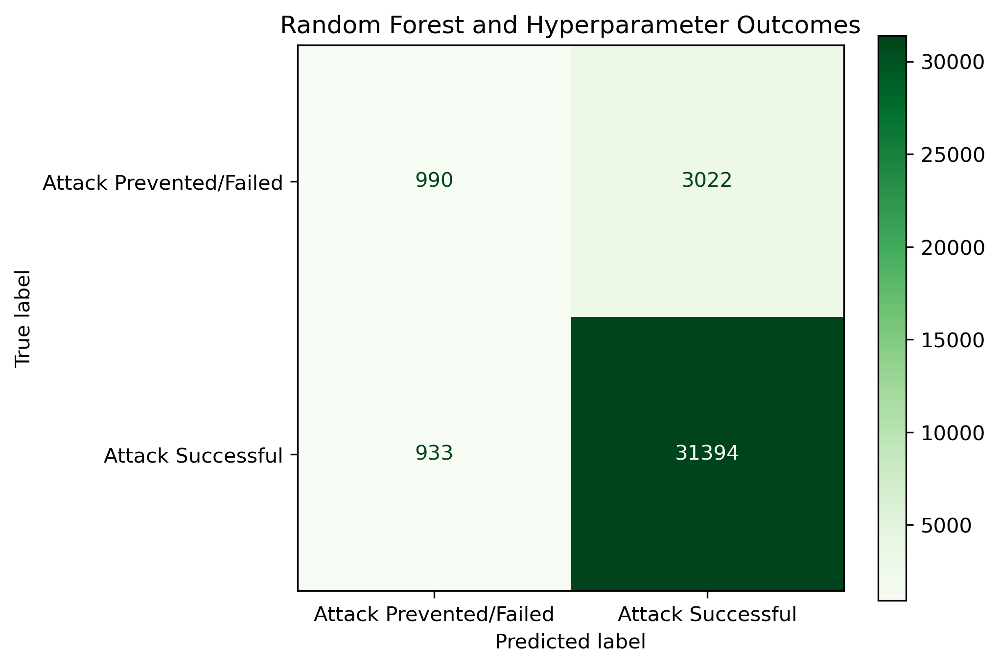
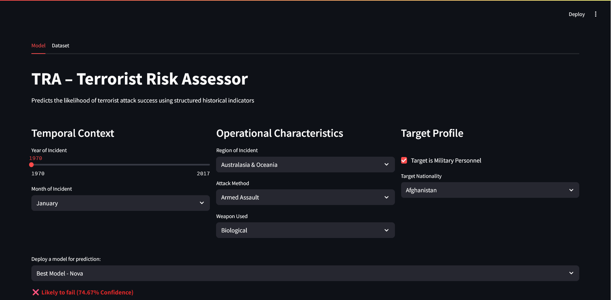
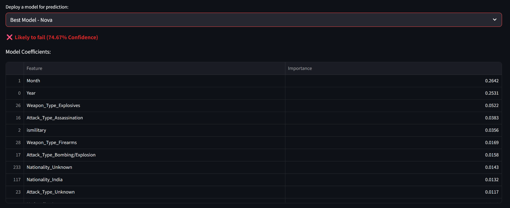

# Threat Assessment Operations (TAO) 
## Hung Nguyen, Supra Coder DDI (Data & Development Immersive) Cohort 13 Capstone

## Table of Contents
- [Overview](#overview)
  - [Project Proposal](#project-proposal)
  - [Pre-Data Cleaning](#pre-data-cleaning)
- [Reproducibility & Setup](#reproducibility--setup)
  - [Crediting Dataset](#crediting-dataset)
  - [Environment Setup](#environment-setup)
- [Exploratory Data Analysis](#exploratory-data-analysis)
  - [Data Cleaning](#data-cleaning)
  - [Data Visualization](#data-visualization)
- [Models Selected](#models-selected)
  - [Confusion Matrix](#confusion-matrix)
- [Data Pipeline](#data-pipeline)
  - [Preprocessor](#preprocessor)
  - [Model Fitting](#model-fitting)
  - [Joblib](#joblib)
- [Streamlit](#streamlit)
- [Lessons Learned](#lessons-learned)
- [Future Directions](#future-directions)

## Overview

### Project Proposal

Threat Assessment Operations (**TAO**) is a capstone project that documents **exploratory data analysis and implements machine learning classification models** to analyze historical terrorist incident data to support training-oriented Terrorist Risk Assessment via interactive user analysis.   

**Research Question**

How can we model insights from historical terrorist incidents to enhance training effectiveness and risk awareness in Terrorist Risk Assessment?
    
**Minimum Viable Product (MVP)**

The Terrorist Risk Assessor (**TRA**) consists of trained machine learning classification models deployed through an interactive Streamlit application. Streamlit enables rapid web-based deployment, allowing live demonstrations through a simple and accessible user interface. Users can interact with historical or hypothetical incident parameters and see how changes affect predicted attack outcomes. The MVP is intended as a complementary analytical tool, supporting Terrorist Risk Assessment by enhancing risk awareness and analytical reasoning rather than replacing human judgment.

### Pre-Data Cleaning 

The dataset contains **181,691 incidents × 135 attributes**. I wrote two functions to address the `Dataset.info()` issue of omitted column outputs due to the large number of columns in the dataset.  

- **`info_dtypes()`** – identifies each column’s data type and summarizes the distribution of numerical and categorical columns to address the omitted columns output.  
- **`summarize_columns()`** – prints, lists, and categorizes all columns into numerical/categorical based on their data types.  

> Output (to see the full output, refer to `info_dtypes()` and `summarize_columns()` functions in `notebooks/eda.ipynb`):

| Category          | Type        | Count |
|------------------|------------|-------|
| **Data Types**    | object     | 58    |
|                   | float64    | 55    |
|                   | int64      | 22    |
| **Columns**       | Numerical  | 77    |
|                   | Categorical| 58    |
| **Total Columns** | —          | 135   |

**Numerical Columns (Float64 + Int64):** 
    
**Examples:** `eventid, iyear, imonth, iday, extended, country, region, latitude, longitude, specificity`

**Categorical Columns (Objects):**

**Examples:** `approxdate, resolution, country_txt, region_txt, provstate, city, location, summary, alternative_txt, attacktype1_txt`

**NaN/Missing Values:**  

106 columns contain **NaN or missing values**. A majority of those columns are sub-categories, which are optional to fill out. This explains why the output shows a wide variation in NaN/missing values across the columns, ranging from nearly all entries missing to only a few.  

    Example
    gsubname3           181671
    weapsubtype4_txt    181621
                        ...  
    specificity              6
    multiple                 1

--- 

## Reproducibility & Setup

### Crediting Dataset

The original Global Terrorism Database (GTD) contains over 180,000 records with 135 columns, which exceeds GitHub’s file size limits. 
Therefore, the dataset is not included in this repository.

> **Dataset:** Global Terrorism Database (**GTD**)  
**Authors/Maintainers:** Study of Terrorism and Responses to Terrorism (**START**), University of Maryland  
**Data Collected:** Historical terrorist incidents worldwide, including attack types, targets, perpetrators, and outcomes

To replicate this project:
1. Create a data/ folder in the repository

> mkdir data

2. Download the GTD dataset CSV from Kaggle:

> https://www.kaggle.com/datasets/START-UMD/gtd

3. Place the downloaded CSV file into the data/ folder

> Example: data/globalterrorismdb_0718dist.csv

**Additional Resources:**   
- [GTD Codebook](https://www.start.umd.edu/gtd/)  
- [UMD START – GTD Portal](https://www.start.umd.edu/gtd/)

## Environment Setup

To replicate the environment exactly, run:

    bash

    1. Create the Conda environment from the YAML file
    conda env create -f ml_global_terror_env.yml

    2. Activate the environment
    conda activate ml_global_terror_env
    

## Exploratory Data Analysis

### Data Cleaning 

The authors/maintainers have already cleaned and formatted the dataset; so, I worked with the pre-processed dataset. Key steps performed on the dataset:

- Checked for Duplicates: None found
- Selected 7 columns out of 135 for target and features
- Renamed 7 columns for clarity
- Created 1 derived column ['ismilitary'] based on targttype1_txt  

### Data Visualization

**Note:** The graphs in this section are **statistical representation**.

This line graph provides **contextual setting for the TAO**, establishing the thematic atmosphere to show how **9/11 played a historically influential role** in the rise of recorded terrorist incidents. 

This bar graph is to take further analysis of the timegraph above into a different perspective with showing distrubtion of recorded incidents among regions.

## Models Selected

To calculate the probability of a terrorist attack's success, I used  classification models to predict and label the success rate based on user input. I also experimented with predictive (regression) model; however, since the target is categorical rather than continuous, the accuracy was extremely low.  

**Classification models used for the MVP:**

>- **Logistic Regression** (`sklearn.linear_model.LogisticRegression`)  
>- **Random Forest** (`sklearn.ensemble.RandomForestClassifier`)  
>- **Random Forest with Hyperparameter Tuning** (`sklearn.ensemble.RandomForestClassifier`)  

**Features (X) & target (y) Selection:** 

    X = df[['Year', 'Month', 'Region', 'Attack_Type','Weapon_Type', 'ismilitary', 'Nationality']]
    y = df['success']

The heatmap below shows correlations between the selected features and the target, helping to visualize which features may have stronger relationships with attack success before training any classification models.

### Confusion Matrix

The confusion matrices below show how well the corresponding classification model predicted between successful and prevented terrorist incidents.

>- True Positives (top-left) indicate the model correctly predicted the attacks as unsuccessful.
>- False Positives (top-right) indicate the model incorrectly predicted the attacks as unsucessful 
>- True Negatives (bottom-right) indicate the model correctly predicted the attacks as successful.
>- False Negatives (bottom-left) indicate the model incorrectly predicted the attacks as sucessful

## Data Pipeline

### Preprocessor

First, I wrote a pipeline_preprocessor() function to produce a re-usable output for multiple classification models. Steps performed:

- Load and clean the dataset
- Select features and target
- Split the data into 80% train and 20% test sets
- Handle numeric and categorical features (imputation, scaling, one-hot encoding)

### Model Fitting

Afterwards, I implemented the fit_log_reg() and fit_rfc_model() functions (located in notebooks/eda.ipynb) to fit the output of pipeline_preprocessor() to do the following steps:

>- Fit the classification model (Logistic Regression or Random Forest)
>- Test the features against the target
>- Print the model’s accuracy score
>- Extract feature importances or model coefficients for interpretation

I also performed hyperparameter tuning for the Random Forest model (bm) to optimize performance, including parameters like the number of estimators, maximum depth, and minimum samples per leaf. This ensures the model achieves better accuracy and generalization.

### Joblib

> **Important:** Trained model files are not included in this repository because they exceed GitHub’s file size limits. You must first run `notebooks/eda.ipynb` to generate the models locally. Model generation may take several minutes depending on hardware specifications, especially when running hyperparameter tuning.

To generate the models:
1. Open `notebooks/eda.ipynb`
2. Run mkdir `model` in terrorism repo
3. Run the notebook sequentially, starting from **Building the ML Model with Pipeline**
4. Continue running all cells until the **Confusion Matrix** section

After fitting and evaluating my three models (log_reg, rfc, and bm), I preserved the trained models and their corresponding metadata using joblib to enable reproducibility and deployment.

>- Model Name and Trained Date
>- Training Data Description
>- Accuracy score/success rate
>- Author Information

## Streamlit

Important: Before launching the Streamlit app, ensure you have:
- The GTD dataset CSV in the data/ folder
- The trained model files in the model/ folder (generated by running notebooks/mvp_testing.ipynb)

---

Streamlit provides a quick, deployable alternative to traditional front-end web development for showcasing interactive applications. Launch the Streamlit application from the `src` folder:

    bash
    cd src
    streamlit run streamlit.py

The TRA landing page organizes seven features/columns into three user-interactive input sections: **Temporal Context**, **Operational Characteristics**, and **Target Profile**. After the user provides input across all three sections, TRA uses three preserved models — **Scout**, **Vanguard**, and **Nova** — to simulate a real-world decision-support workflow, returning a predicted confidence level for whether an attack would be successful or not.

Coefficients/Feature importance for each model is accessible in the Streamlit app after the user inputs. Users can interactively explore how each feature influences the predictions for the three machine learning classification models. 

| Model (Type)                 | Top Features / Coefficients (Head 5) |
|-------------------------------|-------------------------------------|
| Scout (Logistic Regression)   | Attack_Type_Hostage_Barricade, Nationality_Syria, Nationality_Thailand, Nationality_Myanmar, Nationality_Corsica, Nationality_Mexico |
| Vanguard (Random Forest)      | Year, Month, Attack_Type_Assassination, Weapon_Type_Explosives, IsMilitary |
| Nova (Random Forest w/ Tuning)| Month, Year, Weapon_Type_Explosives, Attack_Type_Assassination, IsMilitary |

## Lessons Learned

Feedback highlighted that my early implementation relied heavily on hard-coding, which limited scalability and maintainability. To address this, I began restructuring the project by converting **src/** into a Python package, centralizing configuration in a **constants.py** module to avoid magic strings, and planning to **split library.py into focused utility modules**. I intentionally paused major refactoring after completing the capstone because I wanted the project to reflect my learning journey, but I will revisit these improvements if a future opportunity requires it.

Deploying TRA via Streamlit taught me the importance of writing clean, maintainable scripts. Early in the project, I relied on a **single library.py** file imported across notebooks and scripts, which made dependencies hard to track and files difficult to manage. To improve workflow clarity, I separated Streamlit-specific functions into **streamlit_script.py** while keeping core app logic in **streamlit.py**. This reduced file length, clarified dependencies, and made the app easier to maintain.

From this capstone, I learned how to build end-to-end ML workflows—from data cleaning and modeling to scalable deployment and stakeholder briefing—using a large, real-world dataset. Experimenting with inferential and classification models to evaluate precision, accuracy, recall, and F1 score helped me understand trade-offs and select the most appropriate approach. After the capstone, I’ve been improving my skills through **Google Skill Cloud learning paths** focused on GenAI application development with Gemini, BigQuery ML + Gemini inference, and end-to-end GenAI app deployment on Google Cloud.

## Future Directions

While the current MVP iteration provides a **live demonstration** of an interactive risk assessment with fixed dataset, it only calculates a **single scenario** at a time. **MVP+** could incorporate **fixed input(s) with variation(s)** to evaluate how the model's confidence and accuracy change across different input variations. Further development could include generating a **printable, reportable output** and data visualization(s) with a standardized template, allowing users to document and share the assessment results effectively to non-technical audiences. **MVP++** could explore **live data integration** to support real-world security decision-making; however, **data sovereignty and regulatory constraints** may pose significant challenges.

